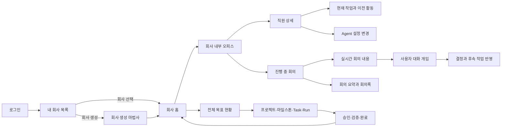

# Agent Company OS 회사 운영 UI 프로세스 설계

> 작성일: 2026-07-16  
> 목적: 기능별 도구 모음을 실제 회사 운영 순서에 맞는 하나의 사용자 여정으로 재구성한다.  
> 범위: 화면 정보구조, 사용자 프로세스, 상태·권한·전환 규칙. 이 문서는 구현 명세의 기준이며 코드 구현은 별도 단계다.

## 구현 상태

- P0 기본 진입 흐름: 완료 (2026-07-16)
- P1 회사 내부와 직원: 완료 (2026-07-16)
- P2 목표 전체 현황: 완료
- P3 회의: 완료
- P4 운영 완성도: 완료 (2026-07-16)

## 1. 결론

사용자가 로그인한 뒤 처음 봐야 하는 것은 개별 Run 실행 화면이 아니다. 사용자가 운영 가능한 회사 목록을 보고 회사를 선택한 뒤, 회사 현황과 내부 공간으로 들어가 직원·프로젝트·회의·목표를 관리하는 흐름이어야 한다.

```text
로그인
  → 운영 회사 목록
  → 회사 선택
  → 회사 현황
  → 회사 내부
      ├─ 직원과 Agent
      ├─ 프로젝트와 목표
      ├─ 회의와 사용자 개입
      ├─ 승인·검증·사고
      └─ 전체 활동 기록
```

현재 시스템에는 인증, 회사 생성과 선택, 회사 현황, Pixel Office, 직원 상태, Run, 승인, 검증, 이벤트, 브리핑의 기반 기능이 존재한다. 그러나 이들이 `/execution`, `/projects`, `/company`, `/pixel-office`, `/platform`에 기능 중심으로 분산돼 있고, 회의 대화·개입·요약은 독립적인 사용자 프로세스로 완성돼 있지 않다.

## 2. 목표 정보구조

로그인 이후 전역 구조는 다음과 같이 정리한다.

```text
회사 선택 전
└─ 내 회사
   ├─ 회사 목록
   ├─ 새 회사 만들기
   └─ 보관된 회사

회사 선택 후
├─ 회사 홈
├─ 회사 내부
│  ├─ 오피스
│  ├─ 직원
│  └─ 부서
├─ 목표·프로젝트
│  ├─ 전체 목표
│  ├─ 프로젝트
│  ├─ 마일스톤·Task
│  └─ 실행 Run
├─ 회의
│  ├─ 진행 중
│  ├─ 예정
│  └─ 회의록·요약
├─ 승인·검증
├─ 활동 기록
└─ 회사 설정
```

전역 헤더에는 현재 회사, 회사 전환, 전체 검색, 미확인 알림, 사용자 계정만 둔다. 회사가 선택되지 않은 상태에서는 회사 내부 메뉴를 비활성화한다.

## 3. 전체 사용자 여정



## 4. 화면별 프로세스

### 4.1 로그인

목적은 인증과 마지막 작업 복구다.

필수 표시:

- 아이디와 비밀번호
- 로그인 실패 이유
- 서버 연결 상태
- 마지막 선택 회사로 이동 여부

성공 후 전환:

- 접근 가능한 회사가 없으면 `새 회사 만들기`
- 회사가 하나면 해당 회사 홈으로 바로 이동 가능
- 회사가 여러 개면 `내 회사 목록`
- 저장된 마지막 회사가 유효하면 해당 회사 홈 복귀 선택 제공

### 4.2 운영 중인 회사 목록

이 화면이 로그인 후 기본 진입점이다.

회사 카드 필수 정보:

- 회사명, 로고, 운영 모드
- Owner와 내 역할
- 진행 중 목표·프로젝트·Run 수
- 현재 활동 직원 수
- 대기 승인·검증 실패·사고 수
- 마지막 활동 시각
- 서버·Agent 연결 건강 상태

필수 기능:

- 회사 생성
- 회사 선택
- 회사명·로고·설명·모드 수정
- 회사 복제
- 회사 보관
- 회사 삭제
- 검색, 상태 필터, 최근 사용 정렬

삭제 규칙:

- 즉시 물리 삭제하지 않고 먼저 `보관` 처리
- Owner 또는 Admin만 가능
- 진행 중 Run·회의·승인이 있으면 삭제 차단
- 회사명 재입력과 영향 범위 확인 후 삭제
- 감사 로그와 백업 보존 정책 표시

### 4.3 회사 생성 마법사

한 화면의 긴 폼이 아니라 다음 단계로 나눈다.

1. 기본 정보: 회사명, ID, 로고, 설명
2. 운영 방식: demo/live, 업무 유형, 기본 워크플로
3. 조직: 부서, 기본 역할, Owner
4. Agent: 기본 backend, model, 역할별 Agent
5. 정책: 예산, 승인, 검증, 허용 도구
6. 확인: 생성될 구성과 위험 요소

생성 완료 후 빈 회사 홈으로 이동하고 `첫 목표 만들기`를 다음 행동으로 제시한다.

### 4.4 회사 홈

회사를 선택하면 가장 먼저 보는 경영 현황 화면이다.

상단 핵심 영역:

- 현재 회사와 운영 상태
- 오늘의 목표 진행률
- 진행 중 프로젝트와 Run
- 현재 활동·대기·차단 직원
- 진행 중 회의
- 승인 필요, 검증 실패, Incident

본문 영역:

- 목표 전체 진행 흐름
- 부서·프로젝트별 건강 상태
- 최근 주요 결정과 회의 요약
- 비용·예산·품질 지표
- 최근 회사 활동 타임라인

사용자에게 항상 보여야 하는 다음 행동:

- 회사 내부 들어가기
- 새 목표 만들기
- 진행 중 회의 참여
- 대기 승인 처리
- 차단된 업무 확인

### 4.5 회사 내부

Pixel Office는 별도 장식 페이지가 아니라 회사 내부의 기본 시각화다.

공간에서 보여야 하는 정보:

- 부서와 회의실
- 직원의 현재 위치와 상태
- 계획·작업·검증·승인·차단 상태
- 진행 중 회의와 참석자
- 프로젝트별 작업 구역
- 긴급 경고와 승인 대기

오브젝트 행동:

- 직원 클릭 → 직원 상세
- 회의실 클릭 → 진행 회의 입장 또는 회의록
- 부서 클릭 → 부서 목표·직원·업무 현황
- 경고 클릭 → 검증·Incident·차단 원인
- 프로젝트 전광판 클릭 → 목표 전체 현황

목록형 화면도 함께 제공해 픽셀 공간을 사용하기 어려운 사용자가 동일 기능에 접근할 수 있어야 한다.

### 4.6 직원 상세

직원은 사람 계정과 AI Agent를 명확히 구분한다.

헤더:

- 이름, 역할, 부서, 사람/AI 구분
- 온라인·대기·작업·회의·차단 상태
- 현재 사용 중인 Agent backend와 model

`현재` 탭:

- 현재 목표, 프로젝트, Task, Run
- 지금 수행 중인 단계와 경과 시간
- 입력 컨텍스트와 기대 결과
- 사용 도구, 비용, 토큰 또는 추정 사용량
- 중지, 재시도, 담당 변경, 상세 실행 이동

`활동 기록` 탭:

- 시간순 이전 동작
- 받은 지시와 생성한 결과
- 검증 결과, 승인, 수정 반복
- 참석 회의와 발언
- 필터: 오늘, 프로젝트, 동작 종류, 성공·실패

`성과·품질` 탭:

- 완료 업무, 품질 통과율, 실패·재작업
- 비용, 평균 처리 시간, Incident
- 역할별 숙련도와 최근 변화

`Agent 설정` 탭:

- backend, model, 프롬프트·역할 템플릿
- 도구 권한, 예산, timeout, 검증 정책
- 회사 기본값 상속 여부
- 연결·로그인 health probe

Agent 수정 규칙:

- 현재 진행 중 Run의 binding은 변경하지 않는다.
- 변경 사항은 기본적으로 다음 Run부터 적용한다.
- 진행 중 Run에 변경을 적용하려면 명시적인 중지·재시작과 영향 확인이 필요하다.
- 변경 전후 값, 변경자, 시각을 감사 로그에 기록한다.

### 4.7 회의 목록

회의 상태는 `예정`, `진행 중`, `결정 대기`, `종료`, `취소`로 구분한다.

목록 항목:

- 회의 제목과 목적
- 연결 목표·프로젝트·Run
- 주최자와 참석자
- 시작 시각·경과 시간
- 현재 안건과 결정 대기 수
- 사용자 참여 가능 여부

진행 중 회의는 회사 홈과 Pixel Office에서 눈에 띄게 표시한다.

### 4.8 실시간 회의실

회의 화면은 다음 3열 구조를 기본으로 한다.

```text
┌──────────────┬──────────────────────────┬──────────────────┐
│ 참석자·상태  │ 실시간 회의 내용         │ 안건·결정·근거   │
│ 발언 순서    │ 사용자 대화 입력          │ 후속 Task        │
└──────────────┴──────────────────────────┴──────────────────┘
```

실시간 회의 내용:

- 발언자, 역할, 시각
- 발언 원문
- 발언이 참조한 목표·결과·Diff·검증 근거
- 시스템 동작과 사람 발언을 시각적으로 구분
- 새 발언 실시간 수신, 읽던 위치 유지, 미읽음 표시

사용자 개입 방식:

- `질문`: 답변을 요청하지만 결정을 바꾸지 않음
- `의견`: 회의 컨텍스트에 참고 의견 추가
- `지시`: 권한 확인 후 회의 진행 방향 변경
- `결정`: 안건을 승인·반려·보류
- `일시중지`: Agent 발언과 후속 실행을 멈춤

대화창 입력 시 대상 범위를 선택한다.

- 전체 참석자
- 특정 직원
- 특정 안건
- 현재 목표·Task

사용자 메시지는 일반 이벤트가 아니라 발언자·권한·대상·시각·연결 근거를 가진 감사 가능한 회의 이벤트로 저장한다.

### 4.9 회의 종료와 요약

회의 종료 시 다음 산출물을 생성한다.

- 한 문단 요약
- 논의 안건별 요약
- 결정 사항
- 미결 사항
- 위험과 이견
- 생성·변경된 목표, Task, 승인 요청
- 담당자와 기한
- 사용자가 개입한 지점
- 원문 회의록 연결

자동 요약은 초안 상태로 생성하고, 중요 회의는 Owner가 확정한다. 확정된 결정만 목표·Task·정책에 자동 반영하며, 반영 전후 차이를 표시한다.

### 4.10 목표 전체 프로세스 현황

목표는 다음 계층으로 추적한다.

```text
회사 목표
└─ 프로젝트
   └─ 마일스톤
      └─ Task
         └─ Run
            ├─ 계획
            ├─ 작업
            ├─ 검증
            ├─ 검토
            ├─ 승인
            └─ 완료 또는 차단
```

목표 상세 상단:

- 목표 문장과 완료 기준
- Owner, 참여 부서·직원
- 전체 진행률과 현재 단계
- 시작일, 목표일, 예상 지연
- 예산·사용량·품질
- 차단 원인과 필요한 사용자 행동

프로세스 보기는 세 가지를 제공한다.

- `계층`: 목표부터 Run까지 구조
- `보드`: 예정·진행·검토·차단·완료
- `타임라인`: 계획 대비 실제 진행

각 단계에는 상태뿐 아니라 근거를 표시한다.

- 무엇이 완료됐는가
- 누가 수행했는가
- 어떤 결과물이 생성됐는가
- 어떤 검증을 통과했는가
- 누가 승인했는가
- 다음 단계가 무엇인가

## 5. 공통 상태 모델

### 회사

`초기 설정 → 운영 중 → 일시중지 → 보관 → 삭제 대기 → 삭제`

### 직원

`오프라인 | 대기 | 계획 | 작업 | 검증 | 검토 | 회의 | 승인 대기 | 차단 | 오류`

### 회의

`예정 → 진행 중 → 결정 대기 → 종료 → 요약 초안 → 확정`

### 목표

`초안 → 계획 → 진행 중 → 검증 → 승인 대기 → 완료`

예외 상태는 `차단`, `보류`, `취소`, `실패`, `재작업`으로 통일한다.

## 6. 권한 기준

| 기능 | Admin | Owner | Manager | Member | Viewer |
|---|---:|---:|---:|---:|---:|
| 회사 생성 | O | O | - | - | - |
| 회사 수정 | O | O | 제한 | - | - |
| 회사 보관·삭제 | O | O | - | - | - |
| 직원·Agent 설정 | O | O | 부서 범위 | 본인 제한 | - |
| 회의 참여 | O | O | O | 초대 시 | 읽기 |
| 회의 지시·결정 | O | O | 범위 내 | - | - |
| 목표 생성·수정 | O | O | 범위 내 | 제안 | - |
| 승인 | O | 정책 지정 | 정책 지정 | 지정 시 | - |

UI는 권한 없는 버튼을 무조건 숨기지 않는다. 사용자가 기능 존재를 알아야 하는 경우 비활성 상태와 필요한 권한을 설명한다.

## 7. 현재 화면과 목표 화면의 대응

| 현재 | 목표 위치 | 판단 |
|---|---|---|
| `/login` | 로그인 | 유지·복구 흐름 보강 |
| `/company` | 회사 목록 + 회사 홈 | 분리 필요 |
| `/pixel-office` | 회사 내부 > 오피스 | 회사 내부 기본 화면으로 편입 |
| 직원 Drawer | 회사 내부 > 직원 상세 | 탭 구조와 Agent 편집 보강 |
| `/projects` | 목표·프로젝트 | 목표 계층 중심으로 재구성 |
| `/execution` | 목표 > Task > Run 상세 | 최상위 진입점에서 하위 실행 화면으로 이동 |
| Review meeting 데이터 | 회의 | 독립적인 목록·실시간 회의실 필요 |
| briefing | 회사 홈·회의 요약 | 근거와 확정 상태 보강 |
| `/platform` | 회사 설정 > 워크플로·연동 | 관리자 설정으로 이동 |
| `/operations` | 시스템 운영 | Admin 전용 유지 |

## 8. 구현 우선순위

### P0 — 기본 진입 흐름

- 로그인 후 회사 목록으로 이동
- 회사 목록 CRUD·선택·보관 프로세스
- 회사 선택 후 회사 홈
- URL과 전역 헤더에 회사 컨텍스트 유지

구현 결과: `/companies` 전용 목록, 생성·수정·선택·안전 보관·복구, `/company` 경영 현황 홈, 로그인 복귀 및 전역 회사 전환을 구현했다. 물리 삭제 대신 감사 가능한 보관을 적용했고 진행 중 Run이 있으면 보관을 차단한다.

### P1 — 회사 내부와 직원

- 회사 내부를 오피스·직원·부서 구조로 통합
- 직원 상세의 현재·활동 기록·성과·Agent 설정 탭
- Agent 변경의 다음 Run 적용 규칙

구현 결과: `/employees`에서 사람·AI Agent, 역할, 부서, 상태, 현재 업무를 검색·필터하고 직원별 현재·활동 기록·성과·Agent 설정 탭을 제공한다. 직원별 binding 저장은 backend health probe를 거치며 현재 Run 스냅샷은 유지하고 다음 Run부터 적용한다.

### P2 — 목표 전체 현황

- 회사 목표 → 프로젝트 → 마일스톤 → Task → Run 계층
- 계층·보드·타임라인 보기
- 완료 기준, 근거, 승인, 차단, 다음 행동 표시

구현 결과: `/goals`에서 Owner가 완료 기준·담당·일정·예산을 가진 회사 목표를 생성하고 회사 프로젝트를 연결할 수 있다. 목표별 진행률·비용·차단·승인·검증 실패·다음 행동을 집계하며, 계층·보드·타임라인에서 프로젝트·마일스톤·Task·Run·결과물·승인 근거로 이동한다. 회사 현황·Pixel Office·프로젝트·실행 화면은 `companyId`, `goalId`, `projectId`, `runId` 컨텍스트를 유지한다.

### P3 — 회의

- 회의 목록과 진행 중 회의 표시
- 실시간 발언 스트림
- 사용자 질문·의견·지시·결정·일시중지
- 회의 요약·결정·후속 Task 생성과 감사 기록

구현 결과: `/meetings`에서 Owner/Manager가 목표·프로젝트·Run 컨텍스트를 가진 회의를 만들고 예정·진행 중·결정 대기·종료·취소 상태를 운영한다. 3열 회의실은 참석자·안건, 실시간 발언과 사용자 입력, 결정·근거·후속 Task를 함께 표시한다. 질문·의견·지시·결정·일시중지는 권한과 대상을 검증한 감사 이벤트로 저장되고 SSE로 반영된다. 종료 시 원문 발언을 기반으로 요약 초안을 생성하며 Owner 확정 후 후속 Task를 프로젝트에 생성한다.

### P4 — 운영 완성도

- 통합 검색과 알림
- 모바일 대응과 접근성
- 회사 보관·삭제·복구
- 성능, 실시간 연결 복구, 감사 로그 검증

구현 결과: `/activity`에서 회사 범위 목표·프로젝트·Task·Run·직원·회의·결정·감사 이벤트를 검색하고 원본 근거로 이동한다. 차단·승인 대기·검증 실패·진행 중 회의·예산 위험·연결 단절을 하나의 알림 피드로 모아 필터·읽음·근거 이동을 제공한다. 회사 보관·복구·삭제 대기 요청은 Owner 권한, 활성 Run·회의·승인·요약 초안 차단 조건, 회사명 재입력과 감사 기록을 적용한다. 데스크톱·모바일 실제 브라우저에서 로그인부터 회의 개입·요약/후속 Task·목표·Run 근거까지의 전 여정과 SSE 단절 후 자동 복구를 검증했다.

## 9. 완료 기준

다음 시나리오가 끊김 없이 수행돼야 한다.

1. 사용자가 로그인하고 접근 가능한 회사 목록을 확인한다.
2. 회사를 생성·수정·선택하고 회사 홈으로 들어간다.
3. 회사 내부에서 진행 중인 직원과 업무를 찾는다.
4. 직원의 현재 작업, 이전 활동, Agent 설정을 확인하고 권한 범위에서 수정한다.
5. 진행 중 회의에 들어가 발언을 보고 대화창으로 개입한다.
6. 회의 종료 후 요약·결정·후속 업무가 목표에 반영된 것을 확인한다.
7. 회사 목표에서 프로젝트·Task·Run·검증·승인·완료 근거까지 추적한다.
8. 모든 변경과 사용자 개입이 권한 및 감사 로그로 검증된다.

이 흐름이 완성돼야 Pixel Office가 단순 시각화가 아니라 실제 회사를 운영하는 제품의 중심 UI가 된다.
